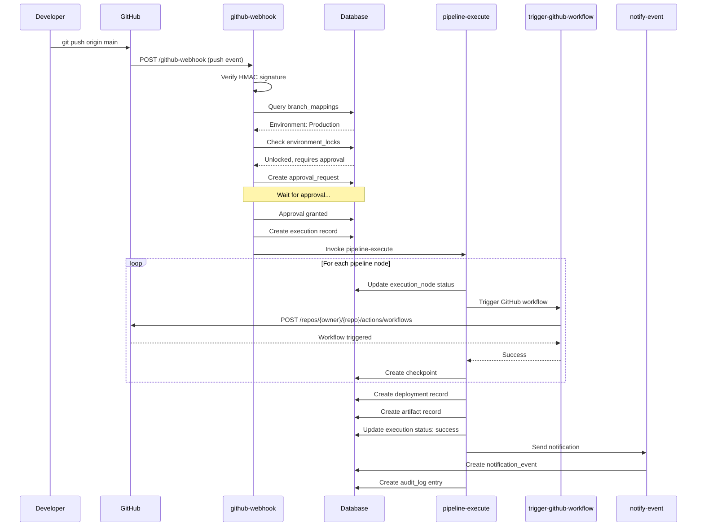
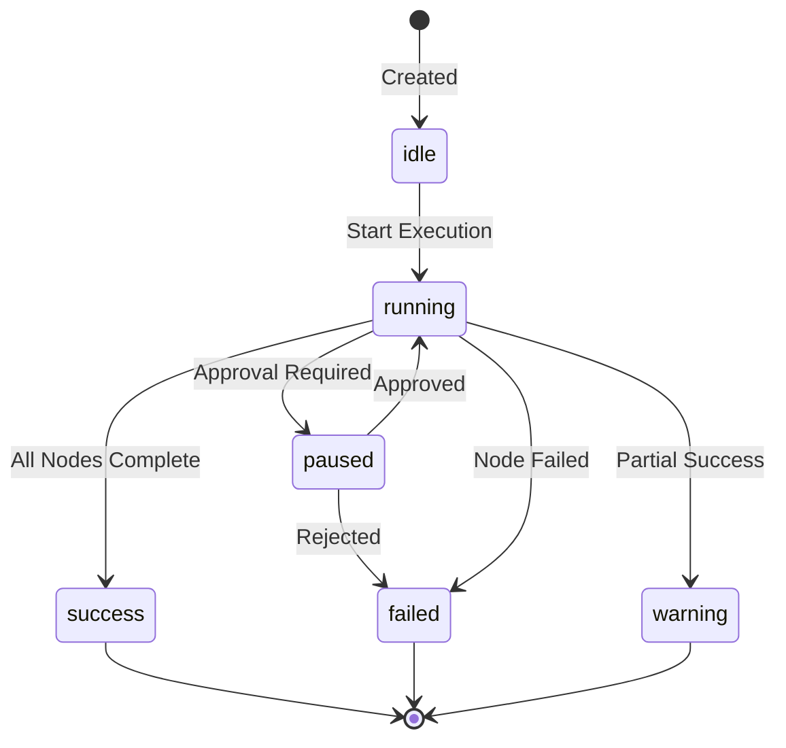
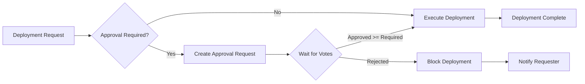
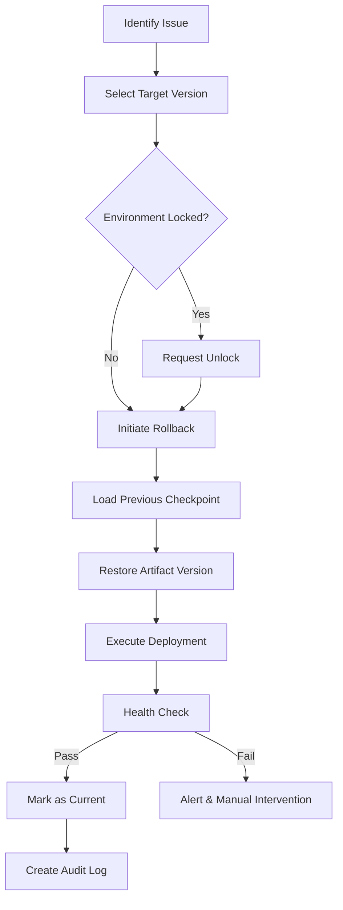

# Opzenix Platform - Deployment Guide

## MVP 1.0.0 Production Setup & GitHub to Production Flow

---

## Table of Contents

1. [Production Setup Prerequisites](#1-production-setup-prerequisites)
2. [GitHub to Production Flow](#2-github-to-production-flow)
3. [Pipeline Execution Flow](#3-pipeline-execution-flow)
4. [Deployment Strategies](#4-deployment-strategies)
5. [Monitoring & Observability](#5-monitoring--observability)
6. [Recovery & Rollback](#6-recovery--rollback)
7. [Security Configuration](#7-security-configuration)
8. [Troubleshooting Guide](#8-troubleshooting-guide)

---

## 1. Production Setup Prerequisites

### 1.1 Required Environment Variables

```bash
# Supabase Configuration (Auto-configured by Lovable Cloud)
SUPABASE_URL=https://qylqudusmwujpagpfrjg.supabase.co
SUPABASE_ANON_KEY=<auto-configured>
SUPABASE_SERVICE_ROLE_KEY=<stored-in-secrets>

# AI Integration
LOVABLE_API_KEY=<stored-in-secrets>

# Voice Features
ELEVENLABS_API_KEY=<stored-in-secrets>

# Database Direct Access
SUPABASE_DB_URL=<stored-in-secrets>
```

### 1.2 GitHub Configuration Checklist

- [ ] GitHub Personal Access Token (PAT) with required scopes:
  - `repo` - Full repository access
  - `workflow` - Workflow management
  - `admin:repo_hook` - Webhook management
- [ ] Webhook URL configured: `https://<project-id>.supabase.co/functions/v1/github-webhook`
- [ ] Webhook secret generated and stored
- [ ] Repository permissions verified

### 1.3 Database Verification

```sql
-- Verify all required tables exist
SELECT table_name 
FROM information_schema.tables 
WHERE table_schema = 'public'
ORDER BY table_name;

-- Verify RLS is enabled on all tables
SELECT tablename, rowsecurity 
FROM pg_tables 
WHERE schemaname = 'public';

-- Verify required functions exist
SELECT proname 
FROM pg_proc 
WHERE pronamespace = 'public'::regnamespace;
```

### 1.4 Edge Function Deployment Checklist

| Function | Purpose | Auth Required |
|----------|---------|---------------|
| `github-webhook` | Receive GitHub events | No (webhook signature) |
| `github-validate-connection` | Validate GitHub token | Yes |
| `pipeline-execute` | Execute pipeline | Yes |
| `connection-health-check` | Monitor connections | No |
| `rollback-deployment` | Rollback deployments | Yes |

---

## 2. GitHub to Production Flow

### 2.1 Complete Flow Diagram

```mermaid
flowchart TB
    subgraph GitHub ["GitHub Repository"]
        DEV[Developer]
        COMMIT[Git Commit/Push]
        PR[Pull Request]
        MERGE[Merge to Branch]
    end

    subgraph Webhook ["Webhook Layer"]
        GH_WEBHOOK[GitHub Webhook Event]
        SIGNATURE[Signature Verification]
        EVENT_PARSE[Event Parsing]
    end

    subgraph BranchMapping ["Branch → Environment Mapping"]
        BRANCH_CHECK{Branch Pattern Match}
        DEV_ENV[Development]
        STAGING_ENV[Staging]
        PREPROD_ENV[PreProd]
        PROD_ENV[Production]
    end

    subgraph Governance ["Governance Layer"]
        ENV_LOCK{Environment Locked?}
        APPROVAL_REQ{Approval Required?}
        APPROVAL_GATE[Approval Gate]
        ROLE_CHECK{Role Authorized?}
    end

    subgraph Execution ["Pipeline Execution"]
        CREATE_EXEC[Create Execution Record]
        LOAD_TEMPLATE[Load Flow Template]
        TOPO_SORT[Topological Sort Nodes]
        
        subgraph NodeExecution ["Node Execution Loop"]
            NODE_START[Start Node]
            NODE_RUN[Execute Node Logic]
            NODE_LOG[Log Execution]
            CHECKPOINT[Create Checkpoint]
            NODE_COMPLETE[Complete Node]
        end
    end

    subgraph Deployment ["Deployment Phase"]
        DEPLOY_START[Initialize Deployment]
        ARTIFACT_REG[Register Artifact]
        VERSION_TAG[Create Version Tag]
        DEPLOY_EXEC[Execute Deployment]
        HEALTH_CHECK[Health Check]
    end

    subgraph Completion ["Completion & Notification"]
        DEPLOY_SUCCESS{Success?}
        RECORD_SUCCESS[Record Success]
        RECORD_FAILURE[Record Failure]
        NOTIFY[Send Notifications]
        AUDIT_LOG[Audit Log Entry]
    end

    %% Flow connections
    DEV --> COMMIT --> GH_WEBHOOK
    PR --> MERGE --> GH_WEBHOOK
    
    GH_WEBHOOK --> SIGNATURE
    SIGNATURE -->|Valid| EVENT_PARSE
    SIGNATURE -->|Invalid| REJECT[Reject Request]
    
    EVENT_PARSE --> BRANCH_CHECK
    BRANCH_CHECK -->|main/master| PROD_ENV
    BRANCH_CHECK -->|release/*| PREPROD_ENV
    BRANCH_CHECK -->|staging| STAGING_ENV
    BRANCH_CHECK -->|develop/*| DEV_ENV
    
    DEV_ENV & STAGING_ENV & PREPROD_ENV & PROD_ENV --> ENV_LOCK
    
    ENV_LOCK -->|Locked| BLOCKED[Execution Blocked]
    ENV_LOCK -->|Unlocked| APPROVAL_REQ
    
    APPROVAL_REQ -->|Yes| APPROVAL_GATE
    APPROVAL_REQ -->|No| ROLE_CHECK
    APPROVAL_GATE -->|Approved| ROLE_CHECK
    APPROVAL_GATE -->|Rejected| BLOCKED
    
    ROLE_CHECK -->|Authorized| CREATE_EXEC
    ROLE_CHECK -->|Unauthorized| BLOCKED
    
    CREATE_EXEC --> LOAD_TEMPLATE --> TOPO_SORT
    TOPO_SORT --> NODE_START
    
    NODE_START --> NODE_RUN --> NODE_LOG --> CHECKPOINT --> NODE_COMPLETE
    NODE_COMPLETE -->|More Nodes| NODE_START
    NODE_COMPLETE -->|All Done| DEPLOY_START
    
    DEPLOY_START --> ARTIFACT_REG --> VERSION_TAG --> DEPLOY_EXEC --> HEALTH_CHECK
    
    HEALTH_CHECK --> DEPLOY_SUCCESS
    DEPLOY_SUCCESS -->|Yes| RECORD_SUCCESS
    DEPLOY_SUCCESS -->|No| RECORD_FAILURE
    
    RECORD_SUCCESS & RECORD_FAILURE --> NOTIFY --> AUDIT_LOG
```



### 2.2 Step-by-Step Flow Description

#### Step 1: Code Push to GitHub
```
Developer → Git Push → GitHub Repository
         ↓
   Branch: feature/*, develop, staging, release/*, main
```

#### Step 2: Webhook Trigger
```typescript
// GitHub sends POST to webhook endpoint
POST /functions/v1/github-webhook
Headers:
  X-GitHub-Event: push | pull_request | workflow_run
  X-Hub-Signature-256: sha256=<HMAC signature>
Body:
  {
    "ref": "refs/heads/main",
    "repository": { "full_name": "owner/repo" },
    "commits": [...],
    "sender": { "login": "username" }
  }
```

#### Step 3: Signature Verification
```typescript
// HMAC SHA-256 verification
const expectedSignature = crypto
  .createHmac('sha256', webhookSecret)
  .update(JSON.stringify(payload))
  .digest('hex');

if (`sha256=${expectedSignature}` !== signature) {
  return new Response('Unauthorized', { status: 401 });
}
```

#### Step 4: Branch to Environment Mapping
```typescript
// Branch mapping rules
const branchMappings = [
  { pattern: 'main', environment: 'Production', deployable: true },
  { pattern: 'master', environment: 'Production', deployable: true },
  { pattern: 'release/*', environment: 'PreProd', deployable: true },
  { pattern: 'staging', environment: 'Staging', deployable: true },
  { pattern: 'develop', environment: 'Development', deployable: true },
  { pattern: 'feature/*', environment: 'Development', deployable: false },
];
```

#### Step 5: Governance Checks
```sql
-- Check environment lock status
SELECT is_locked, lock_reason, required_role, requires_approval
FROM environment_locks
WHERE environment = 'Production';

-- Check user role authorization
SELECT public.has_role(auth.uid(), 'operator') OR 
       public.has_role(auth.uid(), 'admin');
```

#### Step 6: Create Execution Record
```typescript
const execution = await supabase
  .from('executions')
  .insert({
    name: `Deploy ${commit.sha.substring(0, 7)}`,
    environment: mappedEnvironment,
    branch: branchName,
    commit_hash: commit.sha,
    status: 'running',
    governance_status: 'allowed',
    started_by: userId,
    flow_template_id: templateId
  });
```

#### Step 7: Execute Pipeline Nodes
```typescript
// Topological sort for dependency order
const sortedNodes = topologicalSort(nodes, edges);

for (const node of sortedNodes) {
  // Create execution node record
  await createExecutionNode(executionId, node.id);
  
  // Execute based on node type
  switch (node.type) {
    case 'build': await executeBuild(node); break;
    case 'test': await executeTest(node); break;
    case 'deploy': await executeDeploy(node); break;
    case 'approval': await waitForApproval(node); break;
  }
  
  // Create checkpoint after each node
  await createCheckpoint(executionId, node.id, currentState);
}
```

#### Step 8: Deployment & Artifact Registration
```typescript
// Register artifact
const artifact = await supabase
  .from('artifacts')
  .insert({
    name: `${repo}-${version}`,
    execution_id: executionId,
    image_digest: digest,
    image_tag: version,
    registry_url: registryUrl,
    type: 'docker'
  });

// Create deployment record
const deployment = await supabase
  .from('deployments')
  .insert({
    execution_id: executionId,
    environment: targetEnvironment,
    version: versionTag,
    status: 'success',
    deployed_by: userId
  });

// Create version record
await supabase
  .from('deployment_versions')
  .insert({
    project_id: projectId,
    deployment_id: deployment.id,
    environment: targetEnvironment,
    version_tag: versionTag,
    commit_sha: commitSha,
    is_current: true
  });
```

#### Step 9: Notification & Audit
```typescript
// Send notification
await supabase.functions.invoke('notify-event', {
  body: {
    type: 'deployment_complete',
    target: userId,
    payload: { executionId, environment, status: 'success' }
  }
});

// Create audit log
await supabase
  .from('audit_logs')
  .insert({
    action: 'deployment_completed',
    resource_type: 'deployment',
    resource_id: deploymentId,
    user_id: userId,
    details: { environment, version, commit_sha }
  });
```

### 2.3 Sequence Diagram



---

## 3. Pipeline Execution Flow

### 3.1 Node Types and Execution

| Node Type | Purpose | Duration | Creates Checkpoint |
|-----------|---------|----------|-------------------|
| `trigger` | Entry point | Instant | No |
| `build` | Compile/Build | Variable | Yes |
| `test` | Run tests | Variable | Yes |
| `scan` | Security scan | Variable | Yes |
| `approval` | Human approval | Indefinite | No |
| `deploy` | Deploy to env | Variable | Yes |
| `notify` | Send alerts | Instant | No |

### 3.2 Execution State Machine



### 3.3 Checkpoint Structure

```json
{
  "checkpoint_id": "uuid",
  "execution_id": "uuid",
  "node_id": "build-node",
  "name": "post-build-checkpoint",
  "state": {
    "artifacts": {
      "image_digest": "sha256:abc123...",
      "image_tag": "v1.2.3"
    },
    "environment_variables": {
      "NODE_ENV": "production",
      "API_URL": "https://api.example.com"
    },
    "previous_nodes": {
      "trigger-node": "success",
      "build-node": "success"
    },
    "metadata": {
      "commit_sha": "abc123def",
      "branch": "main",
      "timestamp": "2024-01-15T10:30:00Z"
    }
  },
  "created_at": "2024-01-15T10:30:00Z"
}
```

---

## 4. Deployment Strategies

### 4.1 Environment-Specific Rules

| Environment | Requires Approval | Lock Default | Allowed Roles | Auto-Deploy |
|-------------|-------------------|--------------|---------------|-------------|
| Development | No | Unlocked | All | Yes |
| Staging | No | Unlocked | Operator, Admin | Yes |
| PreProd | Yes (1) | Locked | Operator, Admin | No |
| Production | Yes (2) | Locked | Admin only | No |

### 4.2 Lock/Unlock Procedures

```typescript
// Lock an environment
await supabase
  .from('environment_locks')
  .update({
    is_locked: true,
    lock_reason: 'Production freeze for release',
    updated_at: new Date().toISOString()
  })
  .eq('environment', 'Production');

// Unlock with authorization check
const unlock = async (environment: string, userId: string) => {
  const lock = await getLock(environment);
  
  if (!hasRole(userId, lock.required_role)) {
    throw new Error('Unauthorized to unlock this environment');
  }
  
  await supabase
    .from('environment_locks')
    .update({
      is_locked: false,
      unlocked_at: new Date().toISOString(),
      unlocked_by: userId
    })
    .eq('environment', environment);
};
```

### 4.3 Approval Workflow



---

## 5. Monitoring & Observability

### 5.1 Real-time Execution Monitoring

```typescript
// Subscribe to execution updates
const channel = supabase
  .channel('execution-monitor')
  .on(
    'postgres_changes',
    {
      event: '*',
      schema: 'public',
      table: 'executions',
      filter: `id=eq.${executionId}`
    },
    (payload) => {
      updateExecutionStatus(payload.new);
    }
  )
  .on(
    'postgres_changes',
    {
      event: '*',
      schema: 'public',
      table: 'execution_nodes',
      filter: `execution_id=eq.${executionId}`
    },
    (payload) => {
      updateNodeStatus(payload.new);
    }
  )
  .subscribe();
```

### 5.2 Telemetry Signals

```typescript
// Ingest OpenTelemetry signals
const telemetrySignal = {
  signal_type: 'span',
  execution_id: executionId,
  node_id: nodeId,
  otel_trace_id: traceId,
  otel_span_id: spanId,
  duration_ms: duration,
  status_code: 'OK',
  severity: 'info',
  environment: 'production',
  payload: spanAttributes
};

await supabase.from('telemetry_signals').insert(telemetrySignal);
```

### 5.3 Health Check Dashboard Metrics

| Metric | Query | Refresh Rate |
|--------|-------|--------------|
| Active Executions | `SELECT COUNT(*) FROM executions WHERE status = 'running'` | 5s |
| Success Rate (24h) | `SELECT COUNT(*) FILTER (WHERE status = 'success') / COUNT(*) FROM executions WHERE started_at > now() - interval '24 hours'` | 1m |
| Avg Deployment Time | `SELECT AVG(EXTRACT(EPOCH FROM (completed_at - started_at))) FROM executions WHERE status = 'success'` | 5m |
| Pending Approvals | `SELECT COUNT(*) FROM approval_requests WHERE status = 'pending'` | 10s |

---

## 6. Recovery & Rollback

### 6.1 Checkpoint-Based Recovery

```bash
# API Request
curl -X POST \
  'https://qylqudusmwujpagpfrjg.supabase.co/functions/v1/rerun-from-checkpoint' \
  -H 'Authorization: Bearer <token>' \
  -H 'Content-Type: application/json' \
  -d '{
    "checkpoint_id": "uuid-of-checkpoint",
    "execution_id": "uuid-of-execution"
  }'
```

### 6.2 Deployment Rollback

```bash
# API Request
curl -X POST \
  'https://qylqudusmwujpagpfrjg.supabase.co/functions/v1/rollback-deployment' \
  -H 'Authorization: Bearer <token>' \
  -H 'Content-Type: application/json' \
  -d '{
    "deployment_id": "uuid-of-target-deployment",
    "environment": "Production",
    "reason": "Performance degradation detected"
  }'
```

### 6.3 Rollback Flow



---

## 7. Security Configuration

### 7.1 Webhook Signature Verification

```typescript
import { createHmac } from 'crypto';

const verifyWebhookSignature = (
  payload: string,
  signature: string,
  secret: string
): boolean => {
  const expectedSignature = createHmac('sha256', secret)
    .update(payload)
    .digest('hex');
  
  return `sha256=${expectedSignature}` === signature;
};
```

### 7.2 Role-Based Access Control Matrix

| Action | Viewer | Operator | Admin |
|--------|--------|----------|-------|
| View Executions | ✅ | ✅ | ✅ |
| View Audit Logs | Own only | Own only | ✅ All |
| Start Execution | ❌ | ✅ | ✅ |
| Approve Deployments | ❌ | ✅ | ✅ |
| Manage Environment Locks | ❌ | Non-prod only | ✅ All |
| Manage User Roles | ❌ | ❌ | ✅ |
| Access Production | ❌ | Read only | ✅ Full |

### 7.3 RLS Policy Examples

```sql
-- Execution visibility
CREATE POLICY "Authenticated users can view executions"
ON public.executions FOR SELECT
USING (true);

-- Execution management (operators/admins)
CREATE POLICY "Operators can manage executions"
ON public.executions FOR ALL
USING (
  public.has_role(auth.uid(), 'admin') OR 
  public.has_role(auth.uid(), 'operator')
);

-- Audit log protection
CREATE POLICY "Admins can view all audit logs"
ON public.audit_logs FOR SELECT
USING (public.has_role(auth.uid(), 'admin'));

CREATE POLICY "Users can view own audit logs"
ON public.audit_logs FOR SELECT
USING (user_id = auth.uid());
```

### 7.4 GitHub Token Encryption

```typescript
// Tokens are encrypted before storage
const encryptToken = async (token: string): Promise<string> => {
  // Use Supabase Vault for encryption
  const { data } = await supabase.rpc('vault.create_secret', {
    secret: token,
    name: `github_token_${userId}`
  });
  return data.id;
};
```

---

## 8. Troubleshooting Guide

### 8.1 Common Issues

#### Issue: Webhook Not Triggering
```bash
# Check webhook delivery status in GitHub
# Repository → Settings → Webhooks → Recent Deliveries

# Verify edge function logs
# Check supabase/functions/github-webhook logs for errors

# Common causes:
# - Invalid webhook secret
# - Edge function not deployed
# - Network/firewall issues
```

#### Issue: Execution Stuck in Running State
```sql
-- Check for stuck executions
SELECT id, name, status, started_at, 
       EXTRACT(EPOCH FROM (now() - started_at)) / 60 as minutes_running
FROM executions
WHERE status = 'running'
  AND started_at < now() - interval '30 minutes';

-- Force update stuck execution
UPDATE executions
SET status = 'failed',
    completed_at = now(),
    blocked_reason = 'Timeout - manually terminated'
WHERE id = '<execution_id>';
```

#### Issue: Approval Gate Not Proceeding
```sql
-- Check approval status
SELECT ar.*, 
       COUNT(av.id) as vote_count,
       SUM(CASE WHEN av.vote THEN 1 ELSE 0 END) as approvals
FROM approval_requests ar
LEFT JOIN approval_votes av ON ar.id = av.approval_request_id
WHERE ar.execution_id = '<execution_id>'
GROUP BY ar.id;
```

### 8.2 Debug Logging Locations

| Component | Log Location |
|-----------|--------------|
| Edge Functions | Supabase Dashboard → Edge Functions → Logs |
| Database | `postgres_logs` in Analytics |
| Auth Events | `auth_logs` in Analytics |
| API Calls | `function_edge_logs` in Analytics |

### 8.3 Health Check Procedures

```typescript
// Connection health check
const checkConnections = async () => {
  const { data: connections } = await supabase
    .from('connections')
    .select('*')
    .eq('status', 'active');
  
  for (const conn of connections) {
    await supabase.functions.invoke('connection-health-check', {
      body: { connection_id: conn.id }
    });
  }
};

// System health verification
const verifySystemHealth = async () => {
  const checks = [
    { name: 'Database', fn: () => supabase.from('profiles').select('id').limit(1) },
    { name: 'Auth', fn: () => supabase.auth.getSession() },
    { name: 'Edge Functions', fn: () => supabase.functions.invoke('connection-health-check', { body: { test: true } }) },
  ];
  
  const results = await Promise.allSettled(checks.map(c => c.fn()));
  return checks.map((c, i) => ({
    name: c.name,
    status: results[i].status === 'fulfilled' ? 'healthy' : 'unhealthy'
  }));
};
```

---

## Quick Reference Commands

```bash
# Check execution status
curl -X GET \
  'https://qylqudusmwujpagpfrjg.supabase.co/rest/v1/executions?id=eq.<uuid>&select=*' \
  -H 'apikey: <anon_key>'

# Trigger manual pipeline execution
curl -X POST \
  'https://qylqudusmwujpagpfrjg.supabase.co/functions/v1/pipeline-execute' \
  -H 'Authorization: Bearer <token>' \
  -d '{"flow_template_id": "<uuid>", "environment": "Development"}'

# Cancel running execution
curl -X POST \
  'https://qylqudusmwujpagpfrjg.supabase.co/functions/v1/execution-cancel' \
  -H 'Authorization: Bearer <token>' \
  -d '{"execution_id": "<uuid>", "reason": "Manual cancellation"}'
```

---

*Document Version: 1.0.0*
*Last Updated: December 2024*
*Platform: Opzenix MVP 1.0.0*
